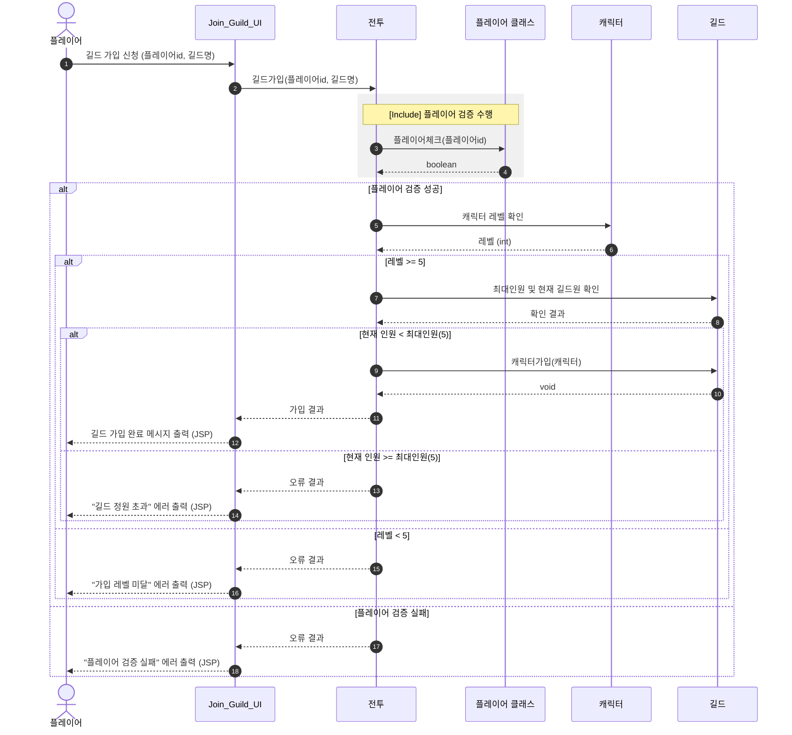

```mermaid
sequenceDiagram
    autonumber
    actor Player as 플레이어
    participant UI as Join_Guild_UI
    participant Battle as 전투
    participant P_Class as 플레이어 클래스
    participant Char as 캐릭터
    participant Guild as 길드

    Player->>UI: 길드 가입 신청 (플레이어id, 길드명)
    UI->>Battle: 길드가입(플레이어id, 길드명)
    
    %% <<include>> 플레이어체크 반영
    rect rgb(240, 240, 240)
        Note over Battle, P_Class: [Include] 플레이어 검증 수행
        Battle->>P_Class: 플레이어체크(플레이어id)
        P_Class-->>Battle: boolean
    end

    alt 플레이어 검증 성공
        Battle->>Char: 캐릭터 레벨 확인
        Char-->>Battle: 레벨 (int)

        alt 레벨 >= 5
            Battle->>Guild: 최대인원 및 현재 길드원 확인
            Guild-->>Battle: 확인 결과
            
            alt 현재 인원 < 최대인원(5)
                %% 클래스 다이어그램에 명시된 메서드 시그니처 반영
                Battle->>Guild: 캐릭터가입(캐릭터)
                Guild-->>Battle: void

                Battle-->>UI: 가입 결과
                UI-->>Player: 길드 가입 완료 메시지 출력 (JSP)
            else 현재 인원 >= 최대인원(5)
                Battle-->>UI: 오류 결과
                UI-->>Player: "길드 정원 초과" 에러 출력 (JSP)
            end
        else 레벨 < 5
            Battle-->>UI: 오류 결과
            UI-->>Player: "가입 레벨 미달" 에러 출력 (JSP)
        end
    else 플레이어 검증 실패
        Battle-->>UI: 오류 결과
        UI-->>Player: "플레이어 검증 실패" 에러 출력 (JSP)
    end
```
