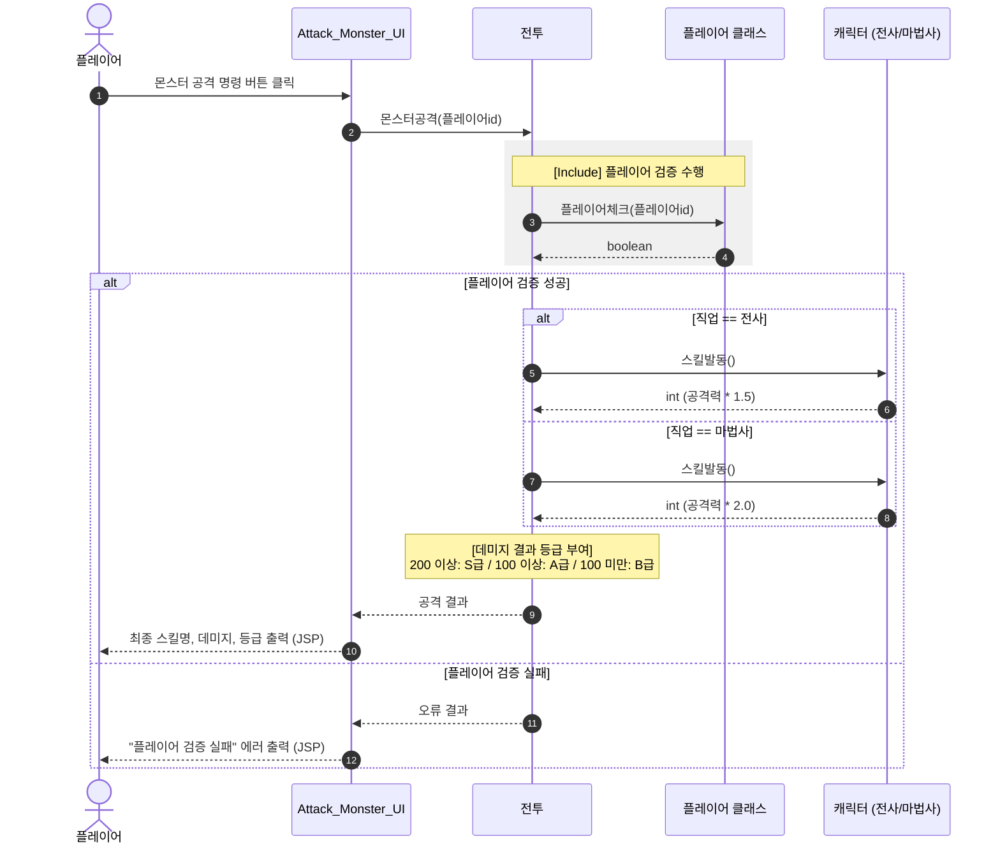

```mermaid
sequenceDiagram
    autonumber
    actor Player as 플레이어
    participant UI as Attack_Monster_UI
    participant Battle as 전투
    participant P_Class as 플레이어 클래스
    participant Char as 캐릭터 (전사/마법사)

    Player->>UI: 몬스터 공격 명령 버튼 클릭
    UI->>Battle: 몬스터공격(플레이어id)
    
    %% <<include>> 플레이어체크 반영
    rect rgb(240, 240, 240)
        Note over Battle, P_Class: [Include] 플레이어 검증 수행
        Battle->>P_Class: 플레이어체크(플레이어id)
        P_Class-->>Battle: boolean
    end

    alt 플레이어 검증 성공
        %% 직업별 고유 스킬 발동
        alt 직업 == 전사
            Battle->>Char: 스킬발동()
            Char-->>Battle: int (공격력 * 1.5)
        else 직업 == 마법사
            Battle->>Char: 스킬발동()
            Char-->>Battle: int (공격력 * 2.0)
        end

        Note over Battle: [데미지 결과 등급 부여]<br/>200 이상: S급 / 100 이상: A급 / 100 미만: B급

        Battle-->>UI: 공격 결과
        UI-->>Player: 최종 스킬명, 데미지, 등급 출력 (JSP)
    else 플레이어 검증 실패
        Battle-->>UI: 오류 결과
        UI-->>Player: "플레이어 검증 실패" 에러 출력 (JSP)
    end
```
